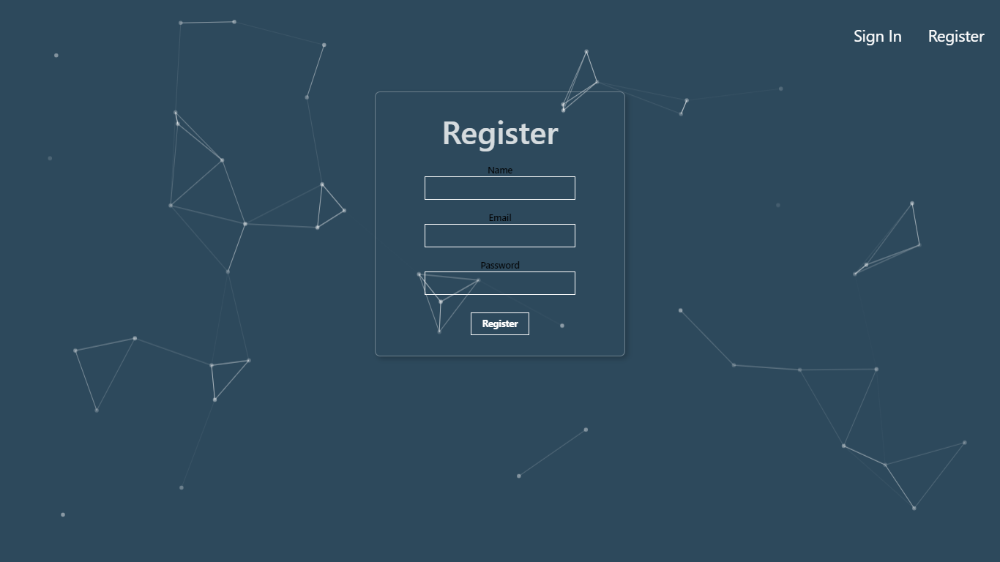
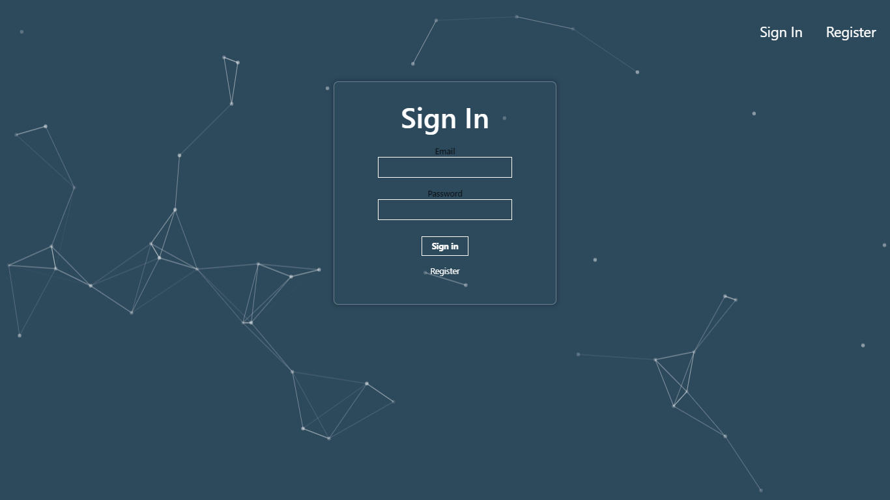
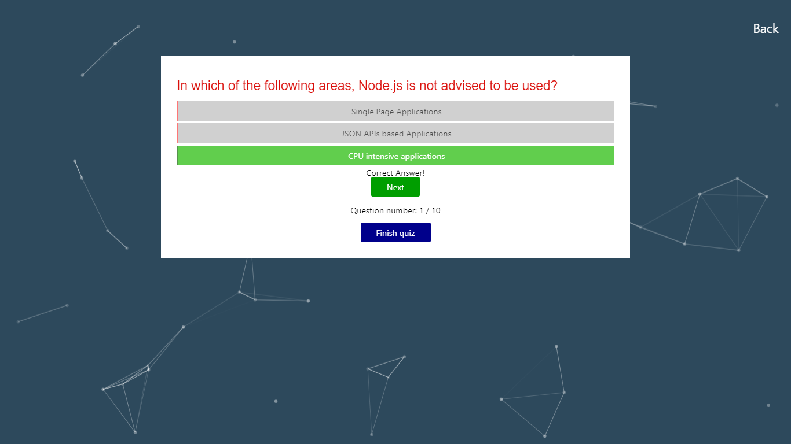

# PERN project for CS 204
* This is a quiz application with user authentification


 



## [API Documentation](https://peaceful-retreat-54716.herokuapp.com/api-docs/)
* To view all users data from database `/all`  HTTP Method: Get
* To view a certain user data from database `/all:id`  HTTP Method: Get
* To sign in `/signin` HTTP Method: Post
* To register `/register` HTTP Method: Post
* To view an authorized user's (your) data `/profile/:id` HTTP Method: Get/Post
* To view and update score `/score` HTTP Method: Put
* To view API documentation `/api-docs` HTTP Method: GET


## Tool / technologies used
* `PERN Stack` (Postgeres Express React Node)
* `bcrypt` for hashing password
* `knex-js` to connect database with the backend
* `particles-js` for background
* `tachyons` for styling
* `REST API`

## [Database schema](https://github.com/Zhantoroev/awesome-api/blob/main/PSQL.txt)

#### Users table example :
| id       | name      | email            | score | joined     |
| ---      | ---       | ---              | ---   | ---        |
| 1        | Syimyk    | syimyk@gmail.com | 55    | 2021-05-09 |

#### Login table example :
| id       | email            | hash                                                         |
| ---      | ---              | ---                                                          |
| 1        | syimyk@gmail.com | $2a$05$LhayLxezLhK1LhWvKxCyLOj0j1u.Kj0jZ0pEmm134uzrQlFvQJLF6 |


## Instructions to build to Docker image 
1. Clone repo
```
git clone https://github.com/beknazar001/frontend-awesome-cats.git
cd frontend-awesome-cats
```
2. Build a docker image with the tag name 'frontend'
```
docker build -t frontend .
```
3. Create a new repo in Docker Hub and Login to docker from CLI
```
docker login
```
4. Change docker image tag
```bash
docker tag frontend <docker-username>/<repo-name>
# If you'd like to add tag you can run
docker tag frontend <docker-username>/<repo-name>:tagname
```
4. Push your image to Docker Hub
```
docker push <docker-username>/<repo-name>:
```

After completing all of those steps above you would have a built docker image that you can use further as the usual docker image<br>
<br>

<h2 style=color:orange> "The only way to do great work is to love what you do."</h2><h3> - Steve Jobs </h3>